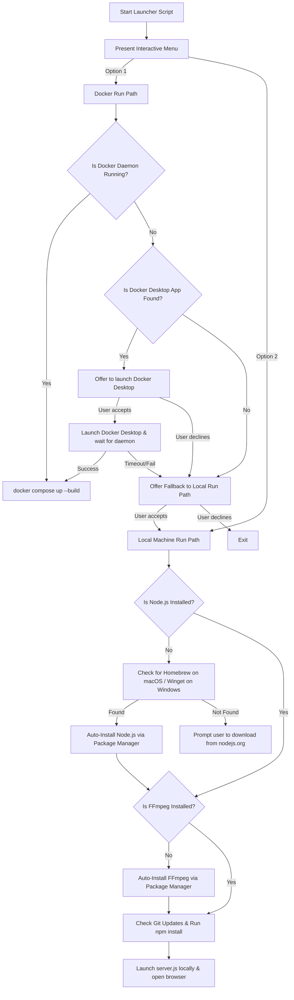

# Design Spec: Multi-Option Installer and Launcher (Docker & Local)

## 1. Overview
This design spec outlines how we will implement a dual-mode installer/launcher system for YTV_Downloader. The goal is to allow users on a new system to choose between running the app in an isolated, pre-packaged [Docker](Dockerfile) container, or running it directly on the host machine with automatic dependency detection and installation (Node.js, FFmpeg, Python).

## 2. Requirements & Goals
- **Privacy:** No external tracking, keys, API details, or user data will be stored or transmitted. Everything is kept local.
- **Cross-Platform:** Both macOS/Linux ([`START.command`](START.command)) and Windows ([`START.bat`](START.bat)) must support the dual-mode prompt.
- **Docker Auto-Launch:** If Docker is chosen but the daemon is not running, look for the local Docker Desktop app, offer to start it automatically, and poll for readiness.
- **Local Auto-Install:** If the local path is chosen or selected as a fallback, detect if `node` or `ffmpeg` are missing and install them automatically using the system's package manager:
  - macOS: Homebrew (`brew`)
  - Windows: Windows Package Manager (`winget`)
- **Robust Fallbacks:** If automatic installation fails or is not supported, provide the user with clear manual installation steps and URLs.

---

## 3. Detailed Architecture & Design Flow

---

## 4. Implementation Details

### 4.1 macOS Launcher ([`START.command`](START.command))
- **Docker Detection:** Run `docker info >/dev/null 2>&1` to verify if the daemon is active.
- **Docker Desktop Path:** Verify the presence of `/Applications/Docker.app`.
- **Docker Startup Command:** `open -a Docker`.
- **Local Auto-Installer Setup:**
  - Check `node` using `command -v node`.
  - Check `ffmpeg` using `command -v ffmpeg`.
  - If any are missing, check `brew` via `command -v brew`.
  - If `brew` is missing, auto-install it: `/bin/bash -c "$(curl -fsSL https://raw.githubusercontent.com/Homebrew/install/HEAD/install.sh)"`.
  - Run `brew install node` and `brew install ffmpeg` as required.

### 4.2 Windows Launcher ([`START.bat`](START.bat))
- **Docker Detection:** Run `docker info >nul 2>nul` to check the daemon.
- **Docker Desktop Path:** Find `Docker Desktop.exe` via `%ProgramFiles%\Docker\Docker\Docker Desktop.exe`.
- **Docker Startup Command:** `start "" "C:\Program Files\Docker\Docker\Docker Desktop.exe"`.
- **Local Auto-Installer Setup:**
  - Check `node` using `where node`.
  - Check `ffmpeg` using `where ffmpeg`.
  - If any are missing, check if `winget` is available using `where winget`.
  - Run `winget install OpenJS.NodeJS` and `winget install Gyan.FFmpeg` as required.
